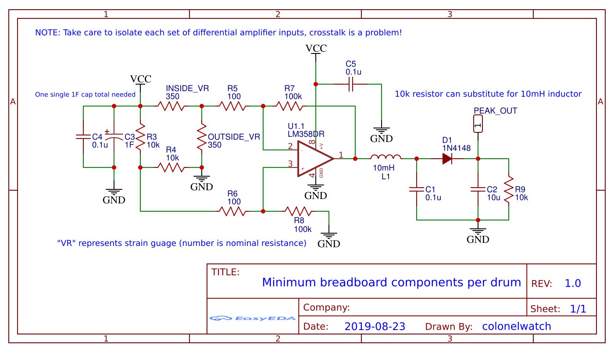

# arduino-usb-drum

This project began as an experiment with strain guages which eventually became a drum. Here, using strain guages instead of the typical piezo sensor for drums enables more flexible design, such as making a 3d-printable model. It runs on an Arduino Uno, which has its serial interface turned into a MIDI input using [LoopMIDI](https://www.tobias-erichsen.de/software/loopmidi.html) and [Hairless MIDI](https://projectgus.github.io/hairless-midiserial/) running on the computer, and feeds into Ableton Live. Everything required to recreate this project is provided, but the code requires calibration due to variability in construction. 

## Explanation

The "drum" is 3D printed with three functional sections: the base, the stem, and the face-plate. The base is clamped to a table, and while one taps out a rhythm on the face-plate, that force causes the stem to bend. That bending can be measured by the strain guages configured in a half bridge which is directly hooked into a differential amplifier. This signal is then fed into a simple peak detector in order to make a response curve that's easy to program for.

The program basically works like this:

1. Because each input is bound to have a varied level of DC bias, the average of twenty samples is taken from each, which is subtracted from all future samples to compensate.
    * Because the circuit is prone to some noise, anything that falls in a certain range is eliminated and replaced with a zero.
2. All samples are fed into what is, in effect, a circular buffer with a size of ten, which the newest sample is compared against to determine if there has been a hit. This is set up for each input.
3. Once a hit has been determined for a certain input, the Arduino continually polls that input to determine a maximum value for a specific amount of time.
4. The maximum value is mapped within the MIDI specification then sent over serial, along with whatever note number that input is assigned and the NOTE_ON header.

## Components

The following are required per drum:
 - 3D-printed model
 - Strain guages (2) with lead wires
 - LM358 (1 per two inputs) and 0.1uF capacitor
 - 1N4148, or any standard diode
 - 10mH inductor, or a 10k resistor
 - 100 resistor (2)
 - 10k resistor (3)
 - 100k resisitor (2)
 - 0.1uF capacitor (2)
 - 10uF capacitor
The following are required regardless of drum count:
 - Arduino Uno
 - 1000uF capacitor

## Schematic

## Demonstration

Will update soon!

## TO-DO

 - Port program to the Arduino Pro Micro, which has a direct USB interface and can be configured as a native MIDI device
 - Eliminate peak detector with further programming
 - Go from half-bridge to quarter-bridge if possible
 - Update code to be more flexible with drums count up to six
 - Migrate from breadboard to PCB or perfboard to mitigate possible crosstalk